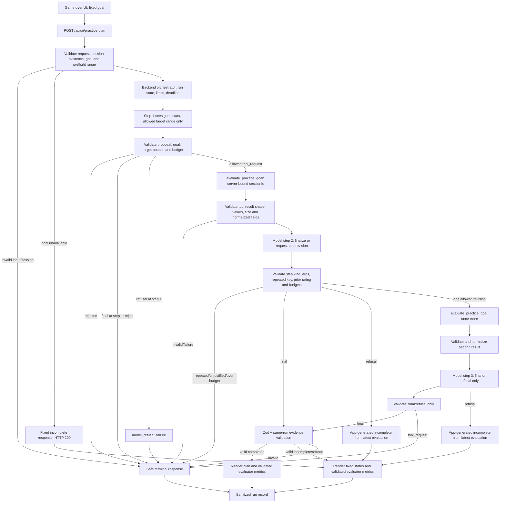

# W05 Agent Flow: AI Practice Plan

## Architecture



## Runtime invariants

- The client submits only `{ sessionId, goal }`; the server validates both and
  looks up/revalidates the session before model/tool calls. Invalid UUID and
  missing session both use HTTP 400 with the same generic body. Corrupted
  stored metrics stop as `session_data_invalid` with that same public response.
- The model sees bounded stats `score`, `durationSeconds`, `foodCollected`;
  collision is omitted. It proposes only `{ goal, targetValue }`.
- Step 1 receives the allowed numeric candidate range but not the rating enum,
  thresholds or formula. The deterministic tool alone computes `rating`; the
  model first sees it in the validated tool result supplied to Step 2/3.
- The orchestrator binds the canonical session ID to the tool input. The
  model cannot change session scope or invoke a dynamic function.
- Tool call is dispatched only after name, schema, goal equality, target range,
  session scope, loop key and remaining budgets all pass.
- Tool result is normalized and checked before it is appended to model context.
- Successful API responses include `{ plan, evaluation }` when the tool ran;
  `evaluation` is the validated normalized tool output. UI metrics must be
  rendered from it, not reconstructed from model text. `goal_unavailable`
  returns `evaluation: null` because no tool ran.
- Every new model decision increments `stepCount`; every actual provider HTTP
  attempt increments `providerAttemptCount`; each actual tool execution
  increments `toolCallCount`. A rejected proposal increments neither tool
  executions nor successful tool calls.
- Terminal runs never issue another provider or tool call. Cancellation aborts
  the active provider request.
- Maximums: 3 steps, 2 tools, 6 provider attempts total, 2 attempts per step,
  30,000 ms total deadline, configured per-call timeout capped by remaining
  time.
- Step 3 only accepts `final` or `refusal`. Any `tool_request` is rejected
  before execution.
- Step 1 only accepts `tool_request` or `refusal`; a `final` is rejected as
  `invalid_model_proposal` because no evaluated evidence exists yet.
- Step-2 tool proposal is justified only if the previous rating was not
  `realistic`; otherwise reject as `tool_not_justified` before execution.
- Tool proposal gate order: step-kind rule; strict proposal/argument parse and
  canonicalization; repeated-call check; step-2 justification; tool limit;
  session scope/deadline/budget; then dispatch. Nothing executes before the
  final gate.
- A tool result that returns after the 250 ms watchdog is discarded and stops
  the run as `tool_timeout`.

## Stop reasons and error mapping

All failure bodies use the fixed user-safe message:
`Plan trenutno nije moguće napraviti bezbedno. Pokušajte ponovo kasnije.`
Do not expose provider details, raw output, stack traces, tool arguments,
session IDs or internal stop reason to the browser. Invalid UUID and missing
session use the same HTTP 400 and generic body to avoid session-existence
disclosure. Corrupted stored statistics (`session_data_invalid`) use that same
HTTP 400/body. Origin rejection is HTTP 403. The application's own rate
limiter returns HTTP 429. A provider 429 is a provider failure mapped to HTTP
503, never to the application's 429; other provider failures map to HTTP 502.
`goal_unavailable` returns a fixed incomplete response with HTTP 200 and no
model/tool call.

The fixed `goal_unavailable` result is app-generated, not model output:

```json
{
  "success": true,
  "plan": {
    "goal": "survive_longer",
    "targetValue": null,
    "summary": "Za izabrani cilj trenutno nema višeg dostižnog praga.",
    "recommendation": "Odigrati novu partiju ili izabrati drugi cilj.",
    "evidence": [],
    "confidence": "low",
    "completed": false
  },
  "evaluation": null
}
```

The `goal` field is replaced with the selected validated enum; other text and
fields are fixed. `targetValue` is null because there is no representable
improvement to evaluate.

### Refusal and invalid-final behavior

The model decision schema represents refusal separately as
`{ kind: "refusal", reasonCode: "insufficient_evidence" }`, never as free-form
text.

| Step | Model decision | Run outcome | HTTP | User-visible result |
|---:|---|---|---:|---|
| 1 | `refusal` | Failure, `model_refusal`; no candidate or evaluated evidence exists | 502, generic error | “Plan trenutno nije moguće napraviti bezbedno. Pokušajte ponovo kasnije.” |
| 1 | `final` | Failure, `invalid_model_proposal`; final before tool evidence is forbidden | 502, generic error | Same generic error |
| 2 | `refusal` | Partial; app synthesizes fixed `completed:false` result from latest validated evaluation | 200 | For `realistic`: “Cilj je ocenjen kao realističan, ali plan nije dovršen. Možeš koristiti prikazani cilj za sledeću partiju.” For other ratings: “Cilj nije preporučen: alat ga je ocenio kao prelak ili preambiciozan.” Validated tool metrics are displayed alongside. |
| 3 | `refusal` | Partial; app synthesizes fixed `completed:false` result from latest validated evaluation | 200 | Same rating-dependent fixed message and validated metrics as Step 2. |

For Step 2/3 refusal the app copies the latest tool-evaluated `goal`,
`targetValue` and evidence, sets confidence to `low`, completed to `false`, and
replaces model prose with the rating-dependent fixed message above. The API
returns the validated normalized tool result alongside the plan; UI renders
its metrics, never metric values from model prose. For `realistic`, the fixed
message must not say the target is not recommended. For non-realistic ratings,
the UI suppresses model recommendation prose and uses the non-realistic fixed
message. `goal_unavailable` has no evaluation and therefore no tool metrics.

| Stop/error reason | Retry? | Stops run? | User-visible behavior |
|---|---|---|---|
| `invalid_input` | No | Yes, before provider/tool | HTTP 400 generic request failure |
| `unauthorized/forbidden` | No | Yes | HTTP 403 for forbidden origin/scope; generic safe body |
| `session_data_invalid` | No | Yes, before provider/tool | Same HTTP 400/body as missing session |
| `request_rate_limited` | No | Yes, before provider/tool | HTTP 429 from this application's limiter |
| `unknown_tool` | No | Yes, before dispatch | HTTP 502 generic safe failure; tool count unchanged |
| `invalid_tool_args` | No | Yes, before dispatch | HTTP 502 generic safe failure; tool count unchanged |
| `tool_not_justified` | No | Yes, before dispatch | HTTP 502 generic safe failure; tool count unchanged |
| `tool_timeout` | No | Yes | HTTP 502 generic safe failure |
| `tool_error` | No | Yes; no automatic tool replay | HTTP 502 generic safe failure |
| `invalid_tool_result` | No | Yes; result not forwarded | HTTP 502 generic safe failure |
| `provider_timeout` | At most one same-step retry after fixed 200 ms if budget/deadline permit | Yes after eligible retry exhausted/deadline | HTTP 502 generic safe failure |
| `provider_unavailable` | At most one same-step retry/allowlisted Gemini model secondary attempt after fixed 200 ms if transient | Yes after exhausted | HTTP 502 generic safe failure |
| `rate_limit` | At most one same-step retry; absent `Retry-After` uses 200 ms; values <=2,000 ms are waited exactly; values >2,000 ms stop without retry. Wait consumes deadline. | Yes after exhausted | Provider 429 maps to HTTP 503, not HTTP 429 |
| `malformed_model_output` | No | Yes | HTTP 502 generic safe failure |
| `invalid_model_proposal` | No | Yes; includes `final` at Step 1 | HTTP 502 generic safe failure |
| `invalid_final_output` | No | Yes; never completed success | HTTP 502 generic safe failure |
| `repeated_call` | No | Yes before duplicate execution | HTTP 502 generic safe failure |
| `max_steps` | No | Yes; step-3 tool proposal is rejected before execution | HTTP 502 generic safe failure |
| `tool_limit` | No | Yes before over-limit execution; tested at independent dispatcher guard | HTTP 502 generic safe failure |
| `deadline` | No | Yes; abort active request | HTTP 502 generic safe failure |
| `cancelled` | No | Yes; abort active request | On client disconnect no HTTP response is possible; record terminal status internally without exposing details |
| `goal_completed` | No | Yes, successful terminal state | Render validated completed plan |
| `goal_unavailable` | No | Yes, preflight stop | HTTP 200 fixed incomplete response, `targetValue:null`; no provider/tool call |
| `model_refusal` | No | Yes | Step 1: HTTP 502 generic failure; Step 2/3: HTTP 200 app-generated incomplete result from latest tool evaluation |

The application's request limiter reason is `request_rate_limited` and returns
HTTP 429; provider `rate_limit` (provider HTTP 429) maps to HTTP 503. Provider
retries are attempts for the current step, not additional agent steps. At most
one secondary request per step and six for the complete run. Transient errors
wait a fixed 200 ms. For provider 429, absent `Retry-After` means 200 ms; values
up to 2,000 ms are waited exactly; values above 2,000 ms are not retried. Every
wait consumes the total deadline. A secondary request uses the same global
budget and remaining deadline; it never
re-executes a completed tool or restarts the run. Cross-provider fallback is
not part of this feature.

## Sanitized run log contract

One user action creates exactly one run record, containing run-level fields
and a `steps[]` array. Do not flatten per-step fields onto the run record.
Each step records only:

```text
  run: { runId, status, providerAttemptCount, retryCount, toolCallCount,
    stopReason, elapsedMs,
    steps: [{ stepNumber, provider, model, latencyMs, decisionKind,
       status, proposalStatus, toolName, validationOutcome,
       providerAttemptCount }] }
```

Do not log goal target values, session ID, score/duration/food values, prompt,
raw model response, raw tool arguments/results, API keys, provider error text,
stack traces or chain-of-thought. `decisionKind` is only
`tool_request | final | refusal`; no free-form reasoning is retained. Runtime
records are structured/sanitized and bounded. Fake/live classification belongs
in the evidence/usage ledger and does not contain provider content.